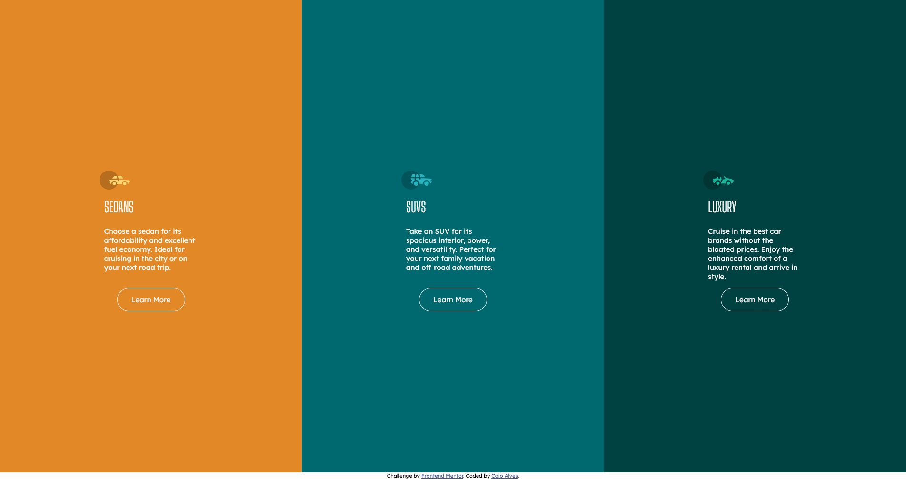

# Frontend Mentor - 3-column preview card component solution

This is a solution to the [3-column preview card component challenge on Frontend Mentor](https://www.frontendmentor.io/challenges/3column-preview-card-component-pH92eAR2-).

## Table of contents

- [Overview](#overview)
  - [The challenge](#the-challenge)
  - [Screenshot](#screenshot)
  - [Links](#links)
- [My process](#my-process)
  - [Built with](#built-with)
  - [What I learned](#what-i-learned)
  - [Continued development](#continued-development)
  - [Useful resources](#useful-resources)
- [Author](#author)

**Note: Delete this note and update the table of contents based on what sections you keep.**

## Overview

### The challenge

Users should be able to:

- View the optimal layout depending on their device's screen size
- See hover states for interactive elements

### Screenshot

### Links

- Solution URL: [Add solution URL here](https://your-solution-url.com)
- Live Site URL: [Add live site URL here](https://your-live-site-url.com)

## My process

### Built with

- HTML5
- CSS custom properties
- Flexbox
- CSS Grid
- Mobile-first workflow

### What I learned

In this challenge I learned better to deal with Grid and Flexbox together, which is a skill that I consider to be important. A lot of the time I was writing code was just placing the elements on the screen, so I think it was a great exercise with these CSS properties.

### Continued development

Use the Grid property more often in other projects. It is a very powerful and complete tool for element placement.

### Useful resources

- [Origmid CSS Grid Course](https://youtu.be/hKXOVD2Yrj8) - André has good didactics to teach and his classes helped me a lot to better understand the property.

## Author

- GitHub [Caio Alves](https://github.com/CaioVito)
- Frontend Mentor - [@CaioVito](https://www.frontendmentor.io/profile/CaioVito)
